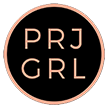

<html>
    
    
	<head>
        <link rel="icon" 
      type="image/png" 
      href="prjgrllogo.png">
	<title> PRJ GRL </title>
        
        <h1> 
          

           
            
 
        </h1> 
        <body>
            

        
 
         Project Girl is a venture that will sponsor Cambodian girls' education by selling coffee.   
         

        
        
 
            <b> Problem: </b>
         Cambodia is a low income country and close to 80% of the population suffers from poverty.  The combination of the country's poverty and increased tourism have unfortunately resulted in high amounts of sexual exploitation.    
      

        
        
 
            <b> Why Does it Matter?:</b> 
            Young, illiterate girls are especially vulnerable to human trafficking, and continue to have limited opportunities due to family and economic pressures. Girls are pressured to stay home, take care of their siblings, and farm in their family's fields. As a result, they do not attend school, remain illiterate, and face a deprived future. 
        

        
        
 
            <b> What Do We Do?: </b> 
            PRJ GRL hopes to send as many girls to school as possible. We will do this by contributing to UNICEF's Girls Be Ambitious Program. Girls Be Ambitious uses donated funds to provide financial assistance to Cambodian families so that they are able to send their girls to school. 50% of our coffee revenue will be sent to the initiative. 
        

     
        
 
            <b> Business Model: </b> 
        

            <ol>
                <li>Source coffee from K and F Coffee Roasters</li> 
                <li>Sell coffee with PRJ GRL branding</li>
                <li>Donate 50% of revenue to Girls Be Ambitious</li>
                <li>Invest the other 50% into the PRJ GRL venture</li>
            </ol>
                
        
 
             --------------  
        

                
        
 
            <b> Additional Information </b> 
        

          
          
 
            <b> Who Are We?: </b> 
              We are two seniors studying business at the University of Maryland in College Park. PRJ GRL is more than just an extracurricular or side project. We are lucky enough to know exactly what our dream job is - and it’s a running a successful social venture.
        
      
                
          
 
            <b> Why Coffee?: </b>
              Coffee energizes and gives us the extra boost needed to accomplish the tasks we set out to do  each and every day. It represents productivity and committment to working hard. Our committment is to empower women through education, and we believe there is no better product to represent our message.  
        

          
           
 
            <b> Target Market: </b> 
               Our target market is general consumers, especially young adults. We want to empower these consumers through their spending. In today’s world, you don’t have to volunteer hours of your time or directly donate money to a cause to help enact change. While these acts are selfless, they are not sustainable. Today’s consumers are seeking more than affluence and materialism, they are seeking meaning. By providing a product that consumers need, we can provide a third option for people to help girls in Cambodia go to school, while also leaving consumers with a warm cup of coffee.
        
      
                   
           
 
            <b> K and F Coffee Roasters: </b> 
              Located in Portland, K and F values community involvment and is known for supporting, engaging, and giving back to organizations across the U.S.
                <a href="http://kfcoffee.com/about-privatelabel/"target="_blank">More Information Here</a>
        

           
         
 
            <b> UNICEF Girls Be Ambitious: </b> 
             Girls Be Ambitious prevents the human trafficking of Cambodian girls through their incentive program that enables families to send their girls to school
             <a href="http://www.cambodiaschools.com/our-programs/girls-be-ambitious/"target="_blank">More Information Here</a>
        

             
--------------
                

           
            

                <b> Donate </b>
                Donate to our <a href="https://www.gofundme.com/yk2af-sponsor-cambodian-girls-education"target="_blank">GoFundMe page</a>! Help us raise $500 so that we can order our first bulk order of coffee and begin selling. Thank you!
               
         
                

                
             
                
            

        </body>
   
    </head>  
</html>
